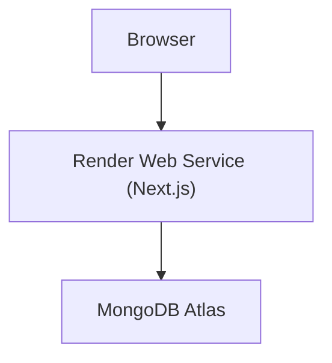

# 🚀 Render Deployment Guide (AetherAvia Store)

This guide describes how to deploy the **AetherAvia Store** Next.js app to **Render** using the repo’s Blueprint file.

## ✅ What the repo already includes

- Blueprint: [render.yaml](render.yaml)
- Build command (Render): `npm install --legacy-peer-deps && npm run build`
- Start command (Render): `npm start` (binds to Render’s `PORT`)

## 🏗️ Architecture (Render)

## 1) Create the Render service (Blueprint)

1. Push the repository to GitHub/GitLab.
2. In Render Dashboard:
   - **New** → **Blueprint**
   - Select your repo
   - Render will read `render.yaml` and create the web service

## 2) Set required environment variables

In [render.yaml](render.yaml), any env var with `sync: false` must be set in Render.

Minimum required:

- `MONGODB_URI`
- `NEXTAUTH_SECRET`
- `NEXTAUTH_URL` (your Render URL or your custom domain URL)

Commonly required (depending on enabled features):

- Cloudinary uploads: `CLOUDINARY_CLOUD_NAME`, `CLOUDINARY_API_KEY`, `CLOUDINARY_API_SECRET`
- Payments (Razorpay): `RAZORPAY_KEY_ID`, `RAZORPAY_KEY_SECRET`, `NEXT_PUBLIC_RAZORPAY_KEY_ID`
- Email: `SMTP_HOST`, `SMTP_PORT`, `SMTP_USER`, `SMTP_PASS`, `SMTP_FROM`

## 3) MongoDB Atlas network access (important)

If you use MongoDB Atlas, Atlas must allow connections from Render.

- If you can’t use a stable IP allowlist, the simplest (but least restrictive) option is to allow `0.0.0.0/0` in Atlas Network Access.
- Also confirm your DB user has the correct permissions for the target database.

## 4) Deploy

1. In Render, trigger a deploy.
2. Watch **Logs** for:
   - a successful build
   - the app starting (listening on Render `PORT`)

Health check you can use after deploy:

- `GET /api/health`

## 5) Seeding (optional)

Render does **not** automatically run seeding scripts during deploy.

Options:

- Run locally against production `MONGODB_URI`: `npm run sync-seed`
- If your Render plan supports Shell: run `npm run sync-seed` in the service shell

## 6) Custom domain (optional)

If you attach a custom domain in Render:

- Update `NEXTAUTH_URL` to `https://your-domain.com`
- If you use `AUTH_URL` in your setup, set it to the same value as well

## Troubleshooting

- Build fails with DB connection errors:
  - Ensure `MONGODB_URI` is set in Render
  - Ensure Atlas Network Access allows Render
- Auth callback issues (NextAuth):
  - Verify `NEXTAUTH_URL` matches the public site URL exactly (https + domain)
  - Verify `NEXTAUTH_SECRET` is set
